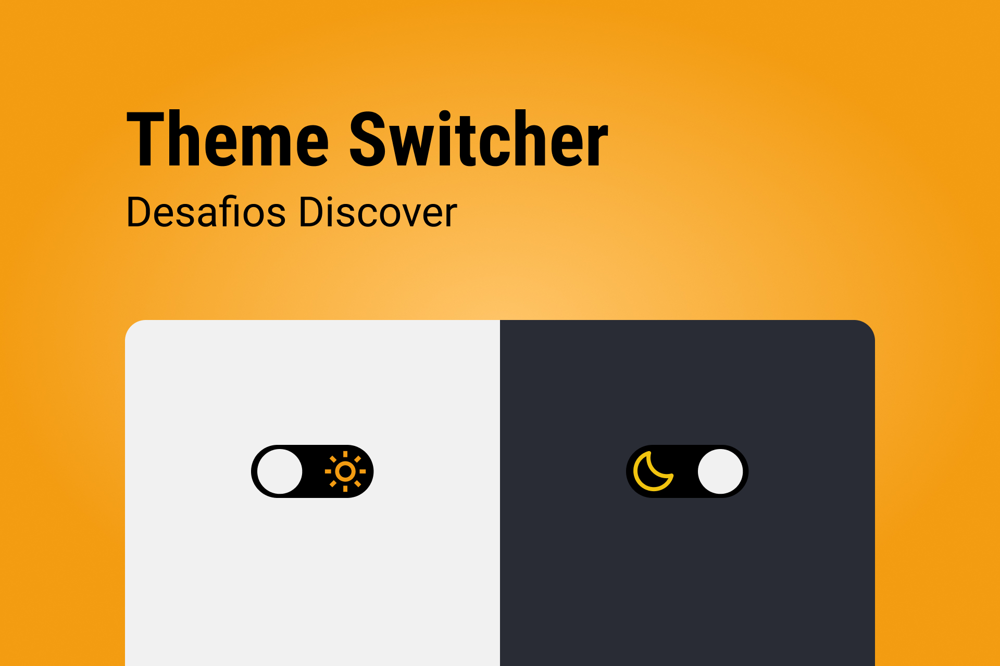

<h1 align="center"> Theme Switcher </h1>

 

  

## 🚀 Tecnologias

Esse projeto foi desenvolvido com as seguintes tecnologias:

- HTML e CSS
- Git e Github
- JavaScript
- Figma

## 💻 Projeto

O Theme Switcher é uma página que contem um toggle para alternar entre o tema dark e light.

- [Acesse o projeto finalizado, online](https://LKaua22k.github.io/Theme-Switcher)

## 📝 Licença

Esse projeto está sob a licença MIT.

---

  Feito com ♥ by Kauã :wave:
